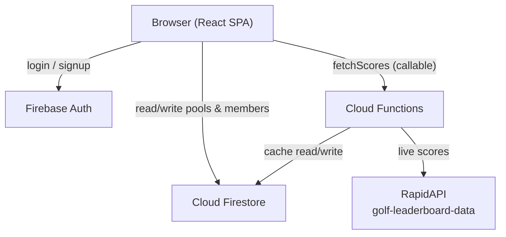
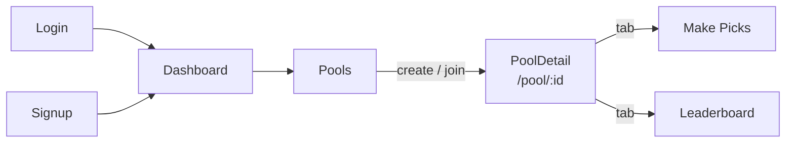
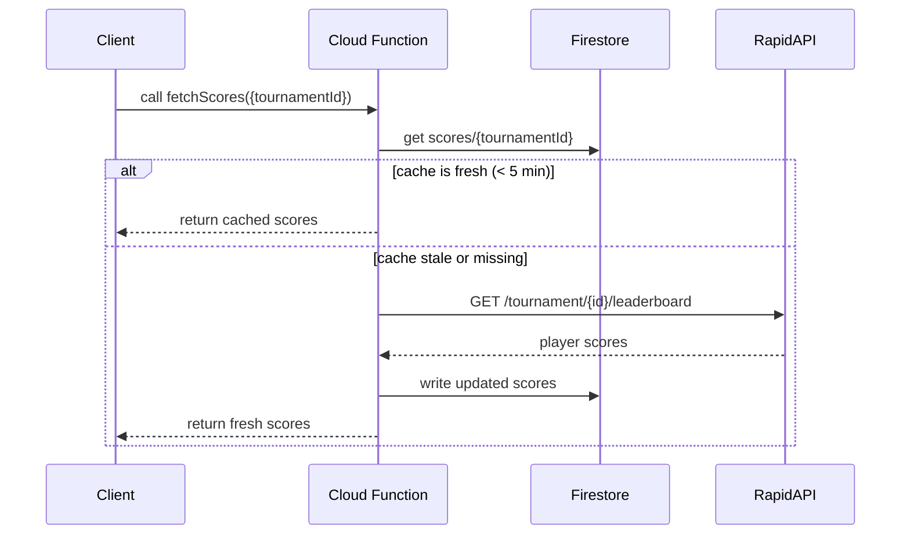
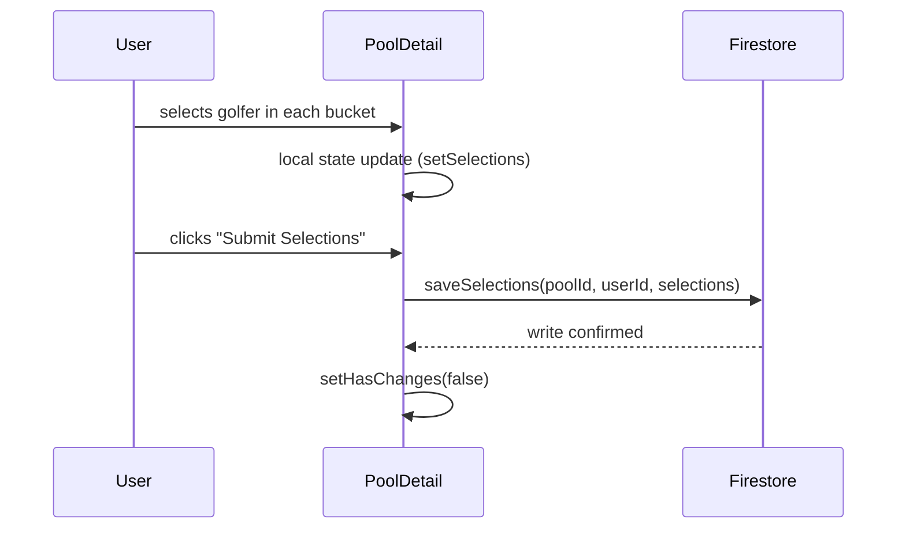

# Architecture

## System Overview

The app is a client-rendered React SPA backed entirely by Firebase. There is no custom API server — the frontend talks directly to Firestore and Firebase Auth, and a single Cloud Function handles score fetching from an external API on a cached basis.



---

## Frontend

### Pages & Routing

All routes are protected except `/login` and `/signup`. Unauthenticated users are redirected to `/login`.

```
/                   → redirect to /dashboard
/login              → Login page
/signup             → Signup page
/dashboard          → Dashboard (pool summary + top picks preview)
/pools              → Pools list (create / join)
/pool/:poolId       → Pool detail (make picks + leaderboard)
```



### Component Tree

```
App
├── AuthProvider          (context: user, login, signup, logout)
└── BrowserRouter
    ├── /login            → Login
    ├── /signup           → Signup
    ├── /dashboard        → Dashboard
    │     └── usePools
    ├── /pools            → Pools
    │     └── usePools
    └── /pool/:poolId     → PoolDetail
          ├── usePool
          ├── useSelections
          ├── useScoring
          ├── useCopyToClipboard
          └── Leaderboard
```

### Hooks

| Hook                     | Responsibility                                  |
| ------------------------ | ----------------------------------------------- |
| `useAuth()`              | Reads auth state from `AuthContext`             |
| `usePools()`             | Fetch user's pools, create, join by code        |
| `usePool(poolId)`        | Fetch single pool + members + user's selections |
| `useSelections(poolId)`  | Save selections to Firestore                    |
| `useScoring(intervalMs)` | Poll `fetchScores` Cloud Function every 30s     |
| `useCopyToClipboard()`   | Copy invite code to clipboard with reset        |

---

## Backend

### Cloud Function: `fetchScores`

An HTTPS callable function. It:

1. Checks Firestore (`scores/{tournamentId}`) for a cached result ≤ 5 minutes old
2. Returns cache if fresh
3. Otherwise calls RapidAPI for live scores, writes result back to Firestore, returns fresh data

The client (via `useScoring`) calls this every 30 seconds. The 5-minute server-side cache ensures RapidAPI is called at most once per 5 minutes regardless of how many users are online.



### Fallback Behavior

If `RAPIDAPI_KEY` is not set, `golfApi.ts` falls back to `generateMockData()` — randomly generated scores for the 22 seeded golfers. This allows full local development with no external dependencies.

---

## Data Flow: Making Picks



Selections are blocked once the pool's `lockTime` has passed (`isLocked = new Date() > pool.lockTime`).

---

## Security

Firestore rules (`firestore.rules`):

| Collection           | Read   | Write                                                           |
| -------------------- | ------ | --------------------------------------------------------------- |
| `pools`              | Anyone | Authenticated users (create); owner only (update/delete)        |
| `pools/{id}/members` | Anyone | Authenticated users (create); member themselves (update/delete) |
| `scores`             | Anyone | Never (admin SDK only, via Cloud Function)                      |
