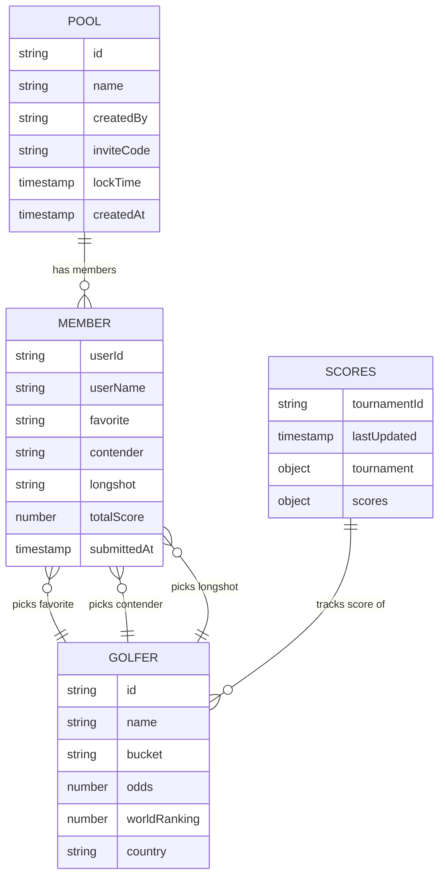

# Data Model

## TypeScript Types

Defined in `src/types/index.ts`.

```typescript
type OddsBucket = "favorite" | "contender" | "longshot";

interface Golfer {
  id: string;
  name: string;
  bucket: OddsBucket;
  odds: number; // e.g. 650 = 6.5:1
  worldRanking: number;
  imageUrl?: string;
  country: string; // ISO country code
}

interface Pool {
  id: string;
  name: string;
  createdBy: string; // Firebase Auth UID
  inviteCode: string; // 6-character uppercase code
  lockTime: Date;
  createdAt: Date;
}

interface PoolMember {
  userId: string;
  userName: string;
  selections: {
    favorite?: string; // Golfer ID
    contender?: string;
    longshot?: string;
  };
  totalScore: number;
  submittedAt: Date;
}

interface Selection {
  favorite?: string;
  contender?: string;
  longshot?: string;
}
```

---

## Firestore Collections

### `pools/{poolId}`

Top-level pool document.

| Field        | Type      | Description                       |
| ------------ | --------- | --------------------------------- |
| `name`       | string    | Display name of the pool          |
| `createdBy`  | string    | UID of the creator                |
| `inviteCode` | string    | Unique 6-char uppercase join code |
| `lockTime`   | Timestamp | After this, picks are frozen      |
| `createdAt`  | Timestamp | Server timestamp on creation      |

### `pools/{poolId}/members/{memberId}`

Subcollection — one document per pool participant.

| Field                  | Type              | Description                                       |
| ---------------------- | ----------------- | ------------------------------------------------- |
| `userId`               | string            | Firebase Auth UID                                 |
| `userName`             | string            | Display name at time of join                      |
| `selections.favorite`  | string \| null    | Golfer ID                                         |
| `selections.contender` | string \| null    | Golfer ID                                         |
| `selections.longshot`  | string \| null    | Golfer ID                                         |
| `totalScore`           | number            | Cached aggregate score (recalculated client-side) |
| `submittedAt`          | Timestamp \| null | When selections were last saved                   |

### `scores/{tournamentId}`

Written exclusively by the `fetchScores` Cloud Function via admin SDK.

| Field                      | Type                      | Description                                    |
| -------------------------- | ------------------------- | ---------------------------------------------- |
| `lastUpdated`              | Timestamp                 | When the cache was last refreshed              |
| `tournament.tournamentId`  | string                    | e.g. `masters-2025`                            |
| `tournament.name`          | string                    | Human-readable tournament name                 |
| `tournament.status`        | `pre` \| `live` \| `post` | Tournament phase                               |
| `tournament.round`         | number                    | Current round (1–4)                            |
| `scores.{golferId}.score`  | number                    | Strokes to/under par (negative = under)        |
| `scores.{golferId}.thru`   | number                    | Holes completed (0–18)                         |
| `scores.{golferId}.status` | string                    | `active` \| `cut` \| `finished` \| `withdrawn` |

---

## Entity Relationships



---

## Static Golfer Data

Golfers are seeded statically in `src/data/mockGolfers.ts` (22 golfers). They do not live in Firestore. The golfer IDs (`'1'`–`'22'`) are the same keys used in the `scores` map in Firestore, linked via `GOLFER_ID_MAP` in `functions/src/golfApi.ts`.

| Bucket      | Count | Odds range   |
| ----------- | ----- | ------------ |
| `favorite`  | 5     | 6.5:1 – 16:1 |
| `contender` | 7     | 22:1 – 45:1  |
| `longshot`  | 10    | 55:1 – 200:1 |
