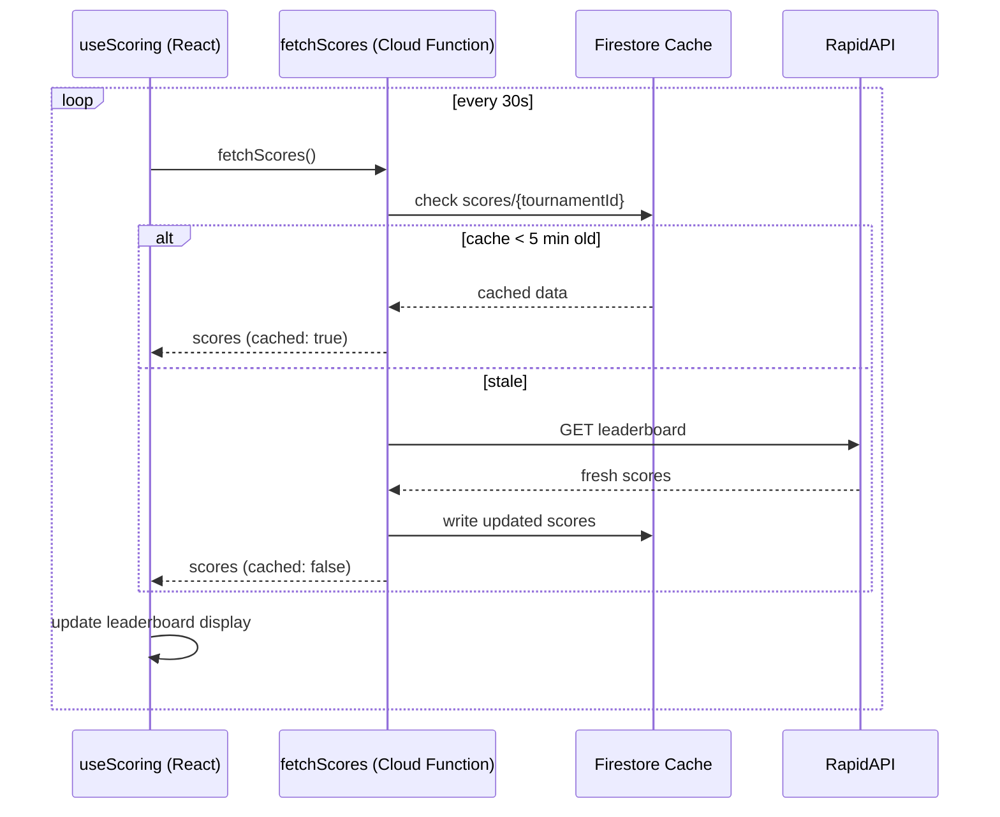

# Scoring

## The Bucket System

Each pool member picks **exactly 3 golfers** — one from each odds tier:

| Bucket        | Description              | Example odds |
| ------------- | ------------------------ | ------------ |
| **Favorite**  | Top-ranked, low odds     | 6.5:1 – 16:1 |
| **Contender** | Mid-tier, moderate odds  | 22:1 – 45:1  |
| **Longshot**  | Outside picks, high odds | 55:1 – 200:1 |

The three-bucket structure forces members to spread picks across the field — you can't just take the top 3 favorites.

---

## Score Calculation

A member's total score = sum of their 3 golfers' tournament scores (strokes relative to par).

```
totalScore = score(favorite) + score(contender) + score(longshot)
```

- **Lower is better** (golf scoring — under par is negative)
- A withdrawn golfer (`status === 'withdrawn'`) contributes **0** to the total
- Cut and finished golfers still count their strokes

### Example

| Golfer            | Bucket    | Score   |
| ----------------- | --------- | ------- |
| Scottie Scheffler | Favorite  | -12     |
| Xander Schauffele | Contender | -8      |
| Jordan Spieth     | Longshot  | +2      |
| **Total**         |           | **-18** |

---

## Leaderboard

Members are ranked by `totalScore` ascending (lowest wins). The leaderboard is visible on the Pool Detail page under the "Leaderboard" tab.

**Scores are hidden until the pool locks.** This prevents late entrants from seeing what others picked and gaming their selections.

After `lockTime`:

- Scores are visible (toggle with "Show Scores")
- Current user is highlighted
- Rank medals: gold (1st), silver (2nd), bronze (3rd)

---

## Score Refresh

The `useScoring` hook polls the `fetchScores` Cloud Function **every 30 seconds**. The function serves cached scores from Firestore (TTL: 5 minutes), so live score updates appear within ~5 minutes of the API updating.



---

## Fallback / Development Mode

When `RAPIDAPI_KEY` is not configured, the Cloud Function falls back to `generateMockData()` which returns randomly generated scores. The frontend also has a local `scoringService.ts` with its own mock score generator used in non-Function contexts.
